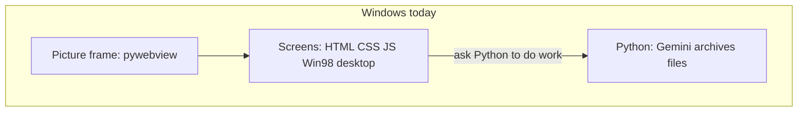
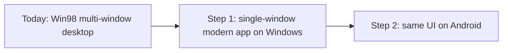

# Single-window first, then Android

## Short answers

**Is Kivy performant, with native-style Android controls?**
No. Kivy draws its own buttons (more like a game engine). It will not look or feel like a normal Android app, and it would mean rebuilding every screen you already have in HTML/JS.

**Are we keeping the Windows 98 desktop?**
No. You want to drop that metaphor entirely and switch to a **straight, single-window app** — first on Windows — so the layout is already close to a phone app before any Android work.

**How involved is this?**
Two projects, in order:

1. **Windows UI conversion** (do this first) — take out the desktop, taskbar, and floating windows; give the app a modern look and simple navigation. This is the big design change. You can test it on your PC by shrinking the window.
2. **Android packaging** (do this second) — put that same UI on a phone, hide the editors, fix file pickers and Google sign-in.

Skipping Image Edit and Video Edit on Android still helps a lot. Kivy would make both steps harder.

**Is the web path much less work than Kotlin/Java? Is it fast enough on a phone?**
Yes, and yes for this kind of app. A Kotlin rewrite is a new product (screens *and* the Python brain). A WebView will not feel like a cheap game; waiting on Gemini and big video files is what users will notice, not the HTML. The honest downsides are a larger install and a slower first launch (because Python is packed into the app), not choppy buttons.

**Would a true Python UI, then Android, be better?**
No, not here. That is a full screen rewrite first, then the same hard APK work. Kivy is usually a worse phone feel than a modern WebView. Other Python GUIs do not reliably produce a nicer Android app without a lot of extra risk.

---

## How the app is built today (plain English)

This is not a typical “Python draws the buttons” program.



- **The picture frame** is [synthetic_text_extruder/app.py](synthetic_text_extruder/app.py) (`pywebview`). One native window showing a local web page.
- **The screens** are [synthetic_text_extruder/ui/](synthetic_text_extruder/ui/) — `index.html`, `styles.css`, `app.js`, plus 98.css. Almost all of the Win98 feel lives here: teal desktop, taskbar, Start menu, draggable windows.
- **Why it is a web UI:** [98.css](https://jdan.github.io/98.css/) is a stylesheet for HTML. Choosing it meant the screens had to be a web page (then shown in `pywebview`). That was the easy way to get a real Win98 look. It was not the *only* possible way (you can paint a similar look in Kivy, Qt, or Kotlin), but 98.css itself does not work in those toolkits.
- **The brain** is the rest of the Python package: Gemini, Archives, settings, tools.

Your plan keeps the **brain** and the **picture frame**. You replace the **desktop chrome** with a normal app shell, then later reuse that same shell on Android.

Kivy would throw away the screens and the picture frame and redraw everything. That fights the “one codebase” goal.

---

## Why Kivy is a poor fit, and why the web UI is better

This is the most common point of confusion: **the app is already a web UI.** Kivy is a *different* way to draw screens. Picking Kivy is not “add Android support.” It is “throw away the current screens and start over.”

**What Kivy actually is**

Kivy is a toolkit where Python draws every button, list, and text box itself, usually with OpenGL (the same kind of drawing games use). On Android it does **not** use Android’s real buttons, scroll views, or text fields. There is an add-on (KivyMD) that *imitates* Google’s look. Imitation is not the same as native. Scrolling, text selection, copy/paste, and the Back gesture often feel slightly wrong. On weaker phones, busy Kivy/KivyMD screens can stutter.

Kivy *can* be a good fit when you are starting a **new** Python app and have no existing screens. That is not this project.

**What you already have**

Almost every screen the user sees is already HTML, CSS, and JavaScript in [synthetic_text_extruder/ui/](synthetic_text_extruder/ui/). Python does the “brain” work (Gemini, files, Archives). Windows only provides a picture frame (`pywebview`) around those pages.

So “convert to Android” does not require a new drawing toolkit. It requires:

1. Rearranging those same pages into a single-window, modern app (your Step 1).
2. Putting the same pages in an Android picture frame (a WebView) later.

A WebView on Android *is* the phone’s built-in browser engine. Text, scrolling, `<video>`, `<audio>`, and forms already work the way people expect on a phone. That is a better match for “closer to a straight Android app” than Kivy’s custom widgets — even though it is still not 100% official Android buttons.

**Side-by-side**

- **Rebuild cost.** Kivy: recreate Studio, Archives, Viewer, Settings, Prompt Editor as new Kivy widgets. Web UI: restyle and re-layout screens that already exist.
- **One codebase.** Kivy: a second UI until (or instead of) the HTML one. Web UI: one set of screens on Windows and Android.
- **Your next step (single-window, modern).** Web pages do this every day (a top or side menu on a PC, a bottom bar on a narrow screen). In Kivy you would build that navigation from scratch, then still package Python for Android.
- **Look and feel.** Neither is “real native Android.” Kivy is further away (game-like canvas). A modern web UI in a WebView is closer to apps people already use (many Android apps are partly web inside).
- **Performance.** For this app (forms, lists, images, video playback, waiting on Gemini), the WebView path is the safer default. Kivy’s extra cost shows up in scrolling and complex layouts, which you will have a lot of.
- **What stays hard either way.** Packaging Python as an APK, file pickers, Google sign-in, long video/music jobs. Kivy does not remove those problems.

**Short version:** Kivy solves “I need to invent a Python UI that also runs on a phone.” You already invented the UI, in the web. The cheaper, cleaner path is to keep that UI and change the picture frame.

---

## Would a “true Python UI,” then Android, be a better result?

**Usually no** — not for this project. “True Python app” sounds cleaner, but it means **throw away the current screens and draw them again** in a Python GUI toolkit, then package that for Android. You still embed Python on the phone. You do not magically get a Play Store–quality native app.

What people hope: Python draws the UI → one button → a proper Android app.

What you actually get, depending on the toolkit:

- **Kivy** — the usual “Python on Android” path. Custom-drawn screens, not Android’s real controls. Often a *worse* look and feel than a modern WebView app. Packaging is more documented than “Python + WebView,” but the product in your hand is rarely nicer.
- **BeeWare / Toga** — Python that *can* use real native widgets. In theory this is the best Python-native result. In practice the toolkit is younger, has fewer widgets, and a complex studio (Viewer, media, tools) is likely to hit missing pieces. High risk, full rewrite.
- **Qt / PySide** — strong on Windows, weak/unofficial on Android. Not a good “then convert” story.
- **Kotlin/Java** — the actually better Android result, and not a Python UI at all.

So “Python UI first” does **not** beat “modern web UI first” on the things you care about:

- **Feel on a phone:** good WebView (Chrome engine) ≥ Kivy; Toga *might* win if it can express the whole app.
- **Work:** Python UI first is an extra full rewrite before you even start Android.
- **One Windows + Android codebase:** both paths can do that. You already have the web half.
- **What stays hard:** APK size, startup, file pickers, Google sign-in. A Python GUI does not remove those.

A true Python UI would only be “better” if you were starting from scratch with no web screens, or if you later needed Kivy-style custom graphics (games). Neither is this app.

---

## Your intended sequence (this is now the plan)



**Step 1 happens only on Windows**, in this same project. No Android tools yet. When the new UI feels right in a tall, narrow window, Step 2 is much smaller.

---

## Step 1 — Windows UI design (settled)

One native window. One screen at a time. No desktop, taskbar, Start menu, or floating windows. Plain modern look (no 98.css). Same seven destinations as today, reached from a hamburger — not from desktop icons.

### App chrome (every screen)

```text
+------------------------------------------------------------------+
|  Creation Studio                                            [ = ]|
+------------------------------------------------------------------+
|  File          AI                                                |
+------------------------------------------------------------------+
|                                                                  |
|                     (this screen’s content)                      |
|                                                                  |
+------------------------------------------------------------------+
|  Status: ready                                                   |
+------------------------------------------------------------------+
```

- **Top bar:** current screen name on the left; **hamburger** on the **upper right** (your call). The hamburger is how you move around the app.
- **Hamburger list:** Creation Studio, Archives, Viewer, Image Editor, Video Editor, Prompt Editor, Control Panel. Choosing one replaces the main area. The top bar title updates.
- **Menu bar** (under the title, File / AI / etc.): screen-specific actions that are buttons today. Menus stay one row so the prompt, list, or preview gets the space.
- **One primary button may stay visible** where it is the whole point of the screen — especially Studio **Create**. Everything else that is “open / import / extract / export / edit” goes into menus.
- **Status bar** at the bottom for short messages (ready, saved, error). Long jobs still use the existing cancelable “please wait” dialog.

Hamburger (not a left sidebar) is the Windows design for now so Android can reuse the same chrome later.

### Control Panel — five tabs instead of two

Today everything is crammed into **AI Model** and **Display & Sound** ([index.html](synthetic_text_extruder/ui/index.html) Control Panel). Split by job:

- **Models** — API key; Text / Image / Video / Audio pickers; Refresh; Recommend Models
- **Generation** — Search grounding, two-pass verify, Use Tools default, OCR-from-search, YouTube captions, temperature, extra system instructions
- **Google** — Workspace OAuth JSON + Connect
- **Storage** — media folder, Browse, project default
- **Appearance** — light / dark / simple custom colors, UI font, display scale, sound on/off and volume

Drop **CRT scanlines** (desktop-metaphor leftover). Custom colors become page / text / accent — not “desktop / title bar / window gray.”

**Save** / **Cancel** stay at the bottom of Control Panel (apply to the current tab, or to all settings — same as today’s two Save buttons, unified into one).

### Per-screen menus (Windows)

**Creation Studio**
- **File:** Load Text, Load Image, Load Video, Clear basis
- **AI:** Create (also keep the big **Create** button), plus anything else that is “run the model”
- Form stays: prompt, Enable Tools checkbox, tools panel, saved-prompt picker, basis preview. Shrink or remove the long Studio Mission banner (a one-line hint or Help item is enough).

**Archives**
- **File:** Import JSON, Export All, Import Text, Import Image, Import Video, Import Audio
- Search box and Name / Type / Created sort stay on the page (they are how you browse, not occasional actions)

**Viewer**
- **File:** Open, Export TXT, Export Metadata, Export PNG, Export PDF, Save MP4/MP3 (shown when they apply)
- **AI:** Extract Text, Extract Layout, Use as Basis, Voice Reader, Save and Send to Creator
- **Edit:** Edit Image, Edit Video (Windows only)
- Document / Media / Extracted / Layout / Sources stay as **content tabs** (they switch what you are looking at, not commands)

**Prompt Editor**
- **File:** New (today’s Add), Save, Delete
- **Edit:** Edit (unlock fields)
- Name + prompt text stay on the page

**Image Editor / Video Editor** (Windows pages, same hamburger)
- **File:** Load, Save, Save As, Save and Send to Creator
- **Edit:** Reset, Apply, Clear Crop, rotate — or keep crop/rotate next to the canvas because they are used while you look at the picture
- Filter sliders stay in the body (they are not menu items)

### What we are not designing yet

Android: same hamburger and menus; hide Image Editor, Video Editor, Viewer **Edit**, and PowerShell. Phone file pickers and APK come after this Windows UI feels right.

The Python brain stays. The rewrite is [index.html](synthetic_text_extruder/ui/index.html), [styles.css](synthetic_text_extruder/ui/styles.css), [app.js](synthetic_text_extruder/ui/app.js) (today’s window manager goes away), plus [README.md](README.md) in the same change.

---

## Step 2 — Put that same app on Android

**On Android: generation, not the editors.**

Keep:

- Creation Studio (including Load / Use as Basis)
- Archives
- Viewer (read, play, save)
- Prompt Editor and Settings
- Tools that still make sense: Search, Gmail, Drive, Docs, Calendar, Tasks, web browse
- Extract Text / Extract Layout (analyze; not crop/filter)

Hide on Android:

- Image Editor, Video Editor, Viewer **Edit**
- PowerShell (Windows-only)

**Still real work on Android (not just hiding buttons):**

- Phone file pickers instead of `C:\...` dialogs
- Archives in the app’s private folder
- Long Veo / Lyria jobs (battery / “still working”)
- Google sign-in for Workspace tools
- Packaging Python into an APK (Buildozer / python-for-android) — the biggest remaining technical hurdle

The picture frame on Android is a WebView showing the **same** HTML/CSS/JS you already converted in Step 1. That is why Step 1 comes first.

---

## Web UI vs a Kotlin/Java rewrite

**Yes — keeping the web UI is a lot less work than starting over in Kotlin/Java.**

Kotlin/Java (or Jetpack Compose) is how “real” Play Store apps are usually built. It would look and start the most native. It is also a **new app**:

- Every screen rebuilt (Studio, Archives, Viewer, Settings, Prompts).
- The Python brain rebuilt too (Gemini text/image/video/music, Archives, tools, jobs). That logic is a large part of this repo. Kotlin cannot just “run your current `.py` files” unless you also embed Python — at which point you did the hard packaging work *and* wrote a second UI.
- You would maintain Windows (Python + web) and Android (Kotlin) as two products, which is the split you wanted to avoid.

The web path reuses both the screens and the brain. Step 1 is rearrange/restyle. Step 2 is a phone picture frame plus packaging. That is still a real project, but it is **not** “write the app twice.”

**Will it be performant enough to not feel terrible?**

For *this* app, yes — if you drop the heavy Win98 desktop chrome first.

What the phone actually does in your generation app:

- Show forms, settings, and a list of Archives
- Show images; play video and music
- Wait on the internet (Gemini / Veo / Lyria)

Android’s WebView is the same engine family as Chrome. That workload is normal for it. After you remove overlapping windows, CRT overlays, and fake desktop dragging, the UI gets **lighter**, not heavier. Users will spend more time waiting on a generation than waiting on a button to paint.

What can still feel imperfect (honest list):

- **App size and first open** — packing Python into an APK makes a fat install and a few-second cold start. Native Kotlin would win here. This is the main “not as slick as a Play Store app” cost, not stuttery scrolling.
- **Very old or tiny-RAM phones** — any WebView + Python combo will be happier on a mid-range or newer device.
- **Huge videos** — the file and the network are the limit, on web or on Kotlin.
- **It will not be pixel-perfect Material You** — it will look like a clean modern web app in a full-screen frame, which is what you asked for.

So: web vs Kotlin is “reuse one app, good enough on a normal phone” vs “best native feel, many extra months, two codebases.” For a Gemini studio you use yourself (or a small audience), web is the sensible trade.

---

## Why Kivy is still the wrong tool

| What you hoped | What happens with Kivy |
| --- | --- |
| Native Android controls | No. Custom-drawn widgets. |
| One UI for Windows + Android | Only if you rewrite the UI in Kivy. You already have a web UI. |
| Modern phone-like app | KivyMD can look “Material-ish,” but you would rebuild Studio, Archives, Viewer, Settings from scratch. |
| Do Windows single-window first | Easier in the current HTML/JS than in a new toolkit. |

Kivy is for a new Python UI with no web screens. That is not this repo.

---

## Effort, in everyday terms

**Step 1 (Windows single-window + modern look)**  
A real UI project: navigation rewrite + restyle. Think weeks, not a weekend. You will feel most of the “Android layout” pain here, which is the point — you debug it on your PC.

**Step 2 (Android)**  
Medium extra work if Step 1 is done: packaging, pickers, sign-in, hide editors. Think more weeks, mostly around the APK and phone OS limits.

**If you had chosen Kivy instead**  
You would redo Step 1 *and* Step 2 in a different toolkit. Months, and a split codebase until the rewrite finished.

---

## Suggested phases (no code until you ask)

1. **Windows chrome** — one window; top bar + hamburger (upper right); File/AI menus; no desktop/taskbar.
2. **Control Panel tabs** — Models, Generation, Google, Storage, Appearance.
3. **Modern/plain restyle** — drop 98.css; move toolbar buttons into menus; keep Create visible in Studio.
4. **Editors as extra pages** — Image Edit / Video Edit from the hamburger and from Viewer → Edit.
5. **Then Android** — same chrome; hide editors + PowerShell; file pickers; APK.

---

## Bottom line

Kivy will not give you native Android controls and is the wrong next step. Kotlin/Java would, but it means rewriting the product.

Your order is right: **make the Windows app a single-window, modern, phone-shaped product first.** That is the shared UI. Android later is the same screens in a different picture frame, minus the two editors. On a typical phone that should feel fine; it will not feel as tiny and instant as a pure Kotlin app.
